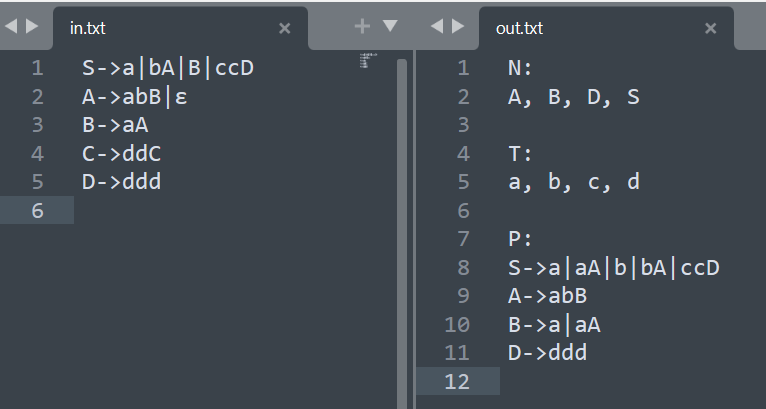
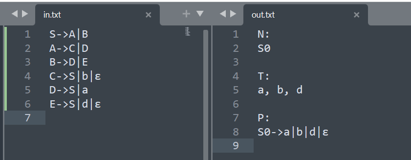
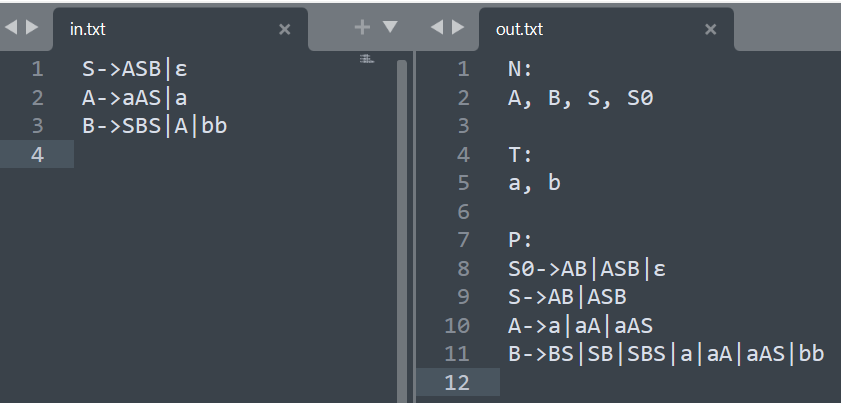
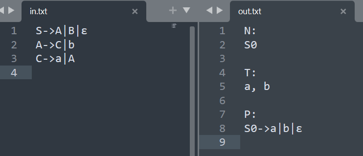

# 实验二：设计上下文无关文法的变换算法

## 小组成员

- 邓思阳 2021211352：编码，调试，报告
- 李永琰 2021211353：编码，优化性能，报告
- 李有鹏 2021211354：查资料，测试，报告
- 吕志杰 2021211355：查资料，测试，报告

## 实验环境

- Windows 10 操作系统

- Python 3.9.13 编程语言
- PowerShell 命令行

## 设计思路

### 数据结构

- 使用三个列表分别存非终结符、终结符、文法产生式，列表元素均为字符串

```python
global N # 非终结符
global T # 终结符
global P # 产生式
N = []
T = []
P = []
```

- 规定了文法的写法后，所有对列表中元素的操作均为字符串的操作

### 函数模块

#### 文件输入输出模块

##### 读入文法

```python
# 从 in.txt 中读取上下文无关文法
def input_cfg():
    global N, T, P
    productions = []
    with open("./in.txt", "r", encoding="utf-8") as work_data:
        productions = work_data.readlines()
        N = get_non_terminator(productions)
        T = get_terminator(productions)
        P = split_productions(productions)
```

- 按行将文法全部读入
- 获取非终结符集合
- 获取终结符集合
- 获取标准化分割后的文法产生式

###### 获取非终结符

```python
# 获取非终结符
def get_non_terminator(productions: list[str]) -> list[str]:
    result = set()
    for production in productions:
        for char in production:
            if char.isupper():
                result.add(char)
    return sorted(result)
```

- 对每一条文法产生式，获取所有的大写字母即为所有非终结符

###### 获取终结符

```python
# 获取终结符
def get_terminator(productions: list[str]) -> list[str]:
    result = set()
    for production in productions:
        for char in production:
            if char.islower():
                result.add(char)
    return sorted(result)
```

- 对每一条文法产生式，获取所有的小写字母即为所有终结符

###### 获取分割后的文法产生式

```python
# 将简写的生成式拆开成统一形式
def split_productions(productions: list[str]) -> list[str]:
    result = []
    for production in productions:
        production = production.strip("\n")
        start = production.split("->")[0]
        sentences = production.split("->")[1].split("|")
        for sentence in sentences:
            result.append(start + "->" + sentence)
    return result
```

- 对每一条简写的文法产生式，先获取产生式左边的起始符
- 再获取右边的生成部分，分别加入文法集合

#### 输出文法

```python
# 向 out.txt 输出变换后的上下文无关文法
def output_cfg():
    global P
    with open("./out.txt", "w", encoding="utf-8") as work_data:
        # 输出非终结符
        work_data.write("N:\n")
        work_data.write(", ".join(N))
        work_data.write("\n\n")
        # 输出终结符
        work_data.write("T:\n")
        work_data.write(", ".join(T))
        work_data.write("\n\n")
        # 输出产生式
        work_data.write("P: \n")
        # 将拆开写的文法合并简写
        productions = wrap_up_productions(P)
        # 将生成式一条条写入输出文件
        for production in productions:
            work_data.write(production)
            work_data.write("\n")
```

- 输出非终结符
- 输出终结符
- 输出文法产生式

##### 文法合并简写

```python
# 将统一形式的文法进行简写
def wrap_up_productions(productions: list[str]) -> list[str]:
    result = []
    starts = set()
    # 将所有生成式左边的非终结符加到集合中
    for production in productions:
        starts.add(production.split("->")[0])
    starts = sorted(starts)
    # 将每个非终结符的产生式合并简写
    for start in starts:
        new_production = start + "->"
        for production in productions:
            if production.split("->")[0] == start:
                new_production += production.split("->")[1] + "|"
        result.append(new_production.strip("|"))
    # 将起始符放到最前面
    for i in range(len(result)):
        if result[i].split("->")[0] == "S":
            result.insert(0, result.pop(i))
            break
    for i in range(len(result)):
        if result[i].split("->")[0] == "S0":
            result.insert(0, result.pop(i))
            break
    # 返回结果
    return result
```

- 将所有左边起始符相等的文法产生式合并
- 并按字典序排列，初始产生式在最上面

#### 算法执行模块

##### 主函数

```python
# 主函数
def main():
    input_cfg()
    transform_cfg()
    output_cfg()
```

- 从文件读入上下文无关文法
- 执行上下文无关文法变换算法
- 将上下文无关文法输出到文件

##### 执行变换算法

```python
# 上下文无关文法变换算法
def transform_cfg():
    eliminate_epsilon_production()
    remove_unit_production()
    remove_useless_symbols()
```

- 消空产生式
- 消单产生式
- 消无用符号

## 核心算法

### 消空产生式

```python
# 消 ε 产生式
def eliminate_epsilon_production():
    global N, T, P
    V = set() # 可致空符号集
    # 找所有可致空符号，删除可致空
    number = -1
    while number != len(V):
        number = len(V)
        for production in P:
            start = production.split("->")[0]
            sentence = production.split("->")[1]
            if sentence == "ε": # 若直接可以推出空
                V.add(start)
                P.remove(production) # 去掉直接推出空的产生式
            elif sentence.isupper(): # 若间接可以推出空
                can_be_null = True
                for char in sentence:
                    if char not in V:
                        can_be_null = False
                        break
                if can_be_null:
                    V.add(start)
    # 对每一个含有可致空符号的产生式
    # 添加去掉可致空符号后组合出来的新产生式
    new_P = set(P) # 新产生式集合
    for production in P:
        start = production.split("->")[0]
        sentence = production.split("->")[1]
        numeber_list = []
        char_list = list(sentence)
        for i in range(len(sentence)):
            if char_list[i] in V:
                numeber_list.append(i)
        if len(numeber_list) != 0:
            new_sentences = get_combinations(sentence, numeber_list, 0)
            for new_sentence in new_sentences:
                 # 构造新产生式要先删除临时插入的 ε，但 A->ε 不能加入
                if new_sentence != "ε":
                    new_P.add(start + "->" + new_sentence.replace("ε", ""))
            numeber_list.clear()
    # 如果起始符本身就可致空，加入新产生式
    if "S" in V:
        new_P.add("S0->S")
        new_P.add("S0->ε")
        N.append("S0")
    # 终结符集合中删除 ε
    if T.count("ε") != 0:
        T.remove("ε")
    # 更新产生式
    P = sorted(new_P)
```

- 首先，定义了一个名为 `V` 的集合，用来存储可致空符号。
- 然后，通过循环找到所有可致空符号，并删除可致空产生式。
  - 如果一个产生式直接可以推出空，则将其左部加入 `V` 集合中，并从产生式集合 `P` 中删除该产生式。
  - 如果一个产生式间接可以推出空，则将其左部加入 `V` 集合中。
- 接下来，对每一个含有可致空符号的产生式，添加去掉可致空符号后组合出来的新产生式。
- 定义一个新的产生式集合 `new_P`，并将原有的产生式集合复制到其中。
  - 对于每一个含有可致空符号的产生式，找到所有可致空符号的位置，并使用 `get_combinations` 函数获取所有可能的新句子。
  - 对于每一个新句子，构造新产生式并添加到 `new_P` 集合中。
- 最后，如果起始符本身就可致空，则在 `new_P` 集合中添加新产生式。在终结符集合 `T` 中删除 ε 符号，并更新产生式集合 `P`。

#### 递归求组合新产生式

```python
# 递归求组合出来的新产生式
def get_combinations(sentence: str, lst: list[int], u: int) -> list[str]:
    new_sentences = []
    # 终止条件：最后一个致空符 取 or 不取
    if u == len(lst) - 1:
        res = list(sentence)
        new_sentences.append("".join(res))
        res[lst[u]] = "ε"
        new_sentences.append("".join(res))
        return new_sentences
    # 当前致空符 取 or 不取
    res = list(sentence)
    new_sentences.extend(get_combinations("".join(res), lst, u + 1)) # 取
    res[lst[u]] = "ε"
    new_sentences.extend(get_combinations("".join(res), lst, u + 1)) # 不取
    # 返回最终结果
    return new_sentences
```

- 该函数接受三个参数：`sentence` 表示当前句子，`lst` 表示可致空符号的位置列表，`u` 表示当前处理到的可致空符号的位置。
- 首先，定义一个名为 `new_sentences` 的列表，用来存储新产生式。
- 然后，判断终止条件：如果当前处理到的可致空符号是最后一个，则将当前句子和去掉最后一个可致空符号后的新句子添加到 `new_sentences` 列表中，并返回该列表。
- 接下来，对于当前处理到的可致空符号，分别考虑取或不取两种情况。
  - 如果取，则直接递归调用 `get_combinations` 函数，并将返回结果添加到 `new_sentences` 列表中。
  - 如果不取，则将当前可致空符号替换为 ε 符号，然后递归调用 `get_combinations` 函数，并将返回结果添加到 `new_sentences` 列表中。
- 最后，返回 `new_sentences` 列表作为最终结果。

### 消单产生式

```python
# 消单产生式
def remove_unit_production():
    global P
    U = get_all_unit_productions(P) # 单产生式集合
    new_P = set(P) - set(U) # 非单产生式集合
    # 将单产生式右边直接给到左边
    lst = []
    for productionA in U:
        startA = productionA.split("->")[0]
        sentenceA = productionA.split("->")[1]
        if startA != sentenceA: # A->B
            for productionB in new_P: # A->B
                startB = productionB.split("->")[0]
                sentenceB = productionB.split("->")[1]
                if startB == sentenceA: # B->alpha
                    lst.append(startA + "->" + sentenceB) # A->alpha
    for string in lst:
        new_P.add(string)
    # 更新消单产生式后的产生式集合
    P = sorted(new_P)
```

- 首先，使用 `get_all_unit_productions` 函数获取所有单产生式，并将其存储在名为 `U` 的集合中。
- 然后，定义一个新的产生式集合 `new_P`，并将原有的产生式集合 `P` 中除去单产生式后的结果复制到其中。
- 接下来，对于每一个单产生式，将其右边直接给到左边。
  - 定义一个名为 `lst` 的列表，用来存储新产生式。
  - 对于每一个单产生式 `A->B`
    -  如果 `A` 不等于 `B`，则遍历 `new_P` 集合中的每一个非单产生式。
    - 如果找到一个非单产生式 `B->alpha`，则构造新产生式 `A->alpha` 并添加到 `lst` 列表中。
- 最后，将 `lst` 列表中的所有新产生式添加到 `new_P` 集合中，并更新产生式集合 `P`。

#### 获取所有单产生式

```python
# 获取所有单产生式
def get_all_unit_productions(productions: list[str]) -> set:
    global N
    result = set()
    for startA in N:
        Na = {startA}
        number = 0
        while number != len(Na):
            number = len(Na)
            for productionB in productions:
                startB = productionB.split("->")[0]
                sentenceB = productionB.split("->")[1]
                if len(sentenceB) == 1 and sentenceB.isupper() and startB in Na:
                    Na.add(sentenceB)
                    result.add(startA + "->" + sentenceB)
    return result
```

- 该函数接受一个参数：`productions` 表示产生式集合。
- 首先，定义一个名为 `result` 的集合，用来存储所有单产生式。
- 然后，遍历非终结符集合 `N` 中的每一个非终结符 `startA`。
  - 定义一个名为 `Na` 的集合，初始值为 `{startA}`。
  - 通过循环找到所有可以从 `startA` 推出的非终结符，并将其添加到 `Na` 集合中。
  - 对于每一个产生式 `B->C`，如果 `C` 是一个非终结符且 `B` 在 `Na` 集合中，则将 `C` 添加到 `Na` 集合中，并将该产生式添加到 `result` 集合中。
- 最后，返回 `result` 集合作为最终结果。

### 消无用符号

```python
# 消无用符号
def remove_useless_symbols():
    remove_non_generating_symbols()
    remove_unreachable_symbols()
```

- 消非生成符号
- 消不可达符号

#### 消非生成符号

```python
# 消非生成符号
def remove_non_generating_symbols():
    global N, P
    new_N = set() # 新非终结符集合
    # 先将所有能够直接生成由终结符组成字符串的非终结符加入集合V
    for production in P:
        start = production.split("->")[0]
        sentence = production.split("->")[1]
        if sentence.islower():
            new_N.add(start)
    # 接下来不断迭代直至找到所有生成符号
    number = 0
    while number != len(new_N):
        number = len(new_N)
        for production in P:
            start = production.split("->")[0]
            sentence = production.split("->")[1]
            is_generating = True
            for char in sentence:
                if char.isupper() and char not in new_N:
                    is_generating = False
                    break
            if is_generating:
                new_N.add(start)
    # 删除含有非生成符号的生成式
    to_be_deleted = set()
    for production in P:
        for char in production:
            if char.isupper() and char in set(N) - new_N:
                to_be_deleted.add(production)
    for char in to_be_deleted:
        P.remove(char)
    # 更新非终结符集合
    N = sorted(new_N)
```

- 首先，定义一个名为 `new_N` 的集合，用来存储新的非终结符集合。
- 然后，遍历产生式集合 `P` 中的每一个产生式。
  - 如果一个产生式能够直接生成由终结符组成的字符串，则将其左部加入 `new_N` 集合中。
- 接下来，通过循环找到所有生成符号。
  - 定义一个变量 `number`，用来记录上一次迭代时 `new_N` 集合的大小。
  - 对于每一个产生式，如果其右部所有字符都是生成符号，则将其左部加入 `new_N` 集合中。
- 然后，删除含有非生成符号的生成式。
  - 定义一个名为 `to_be_deleted` 的集合，用来存储需要删除的产生式。
  - 对于每一个产生式，如果其中含有非生成符号，则将该产生式添加到 `to_be_deleted` 集合中。
  - 最后，从产生式集合 `P` 中删除 `to_be_deleted` 集合中的所有产生式。

- 最后，更新非终结符集合 `N`。

#### 消不可达符号

```python
# 消不可达符号
def remove_unreachable_symbols():
    global N, T, P
    # 新非终结符集合
    if "S0" in N:
        new_N = {"S0"}
    else:
        new_N = {"S"}
    # 新终结符集合
    new_T = set()
    # 新产生式集合
    new_P = set()
    # 迭代找可达符号集合
    number = 0
    while number != len(new_N):
        number = len(new_N)
        # 遍历，找到起始符可达的生成式
        for production in P:
            start = production.split("->")[0]
            sentence = production.split("->")[1]
            # 将生成式右边的内容全部加入新的终结符、非终结符集合
            if start in new_N:
                for char in sentence:
                    if char.isupper():
                        new_N.add(char)
                    elif char.islower():
                        new_T.add(char)
    # 将可达符号加入新生成式集合
    for production in P:
        start = production.split("->")[0]
        sentence = production.split("->")[1]
        if start in new_N:
            new_P.add(production)
    # 终结符不包含 ε
    if "ε" in new_T:
        new_T.remove("ε")
    # 更新非终结符、终结符、生成式集合
    N = sorted(new_N)
    T = sorted(new_T)
    P = sorted(new_P)
```

- 首先，定义新的非终结符集合 `new_N`，终结符集合 `new_T` 和产生式集合 `new_P`。
  - 如果非终结符集合 `N` 中包含 `S0` 符号，则将 `S0` 符号加入 `new_N` 集合中
  - 否则将 `S` 符号加入 `new_N` 集合中。
- 接下来，通过循环找到所有可达符号集合。
  - 定义一个变量 `number`，用来记录上一次迭代时 `new_N` 集合的大小。
  - 对于每一个产生式，如果其左部在 `new_N` 集合中，则将其右部所有字符都加入新的终结符或非终结符集合中。
- 然后，将可达符号加入新生成式集合。
  - 对于每一个产生式，如果其左部在 `new_N` 集合中，则将该产生式添加到 `new_P` 集合中。
- 最后，如果终结符集合 `new_T` 中包含 ε 符号，则将其删除。
- 更新非终结符集合 `N`、终结符集合 `T` 和产生式集合 `P`。

## 程序演示

### 输入/输出格式

#### 输入

- 程序从文件 `in.txt` 中读取以一定字符串格式存储的待变换的上下文无关文法，以相同格式输出变换后的上下文无关文法到文件 `out.txt`
- 一个文件中仅保存一个文法的所有生成式，每个生成式占一行
- 终结符仅由 26 个小写英文字母表示
- 非终结符仅由 26 个大写英文字母表示
- 空字符由 UTF-8 编码的希腊字母 `ε`（`0x03B5`）表示
- 生成式的起始符默认为 `S`
- 用 `->` 表示生成符号；用 `|` 隔开由同一个非终结符生成的内容
- 如下样例所示：

```in
S->a|bA|B|ccD
A->abB|ε
B->aA
C->ddC
D->ddd

```

#### 输出

- 第一部分是非终结符 `N`
- 第二部分是终结符 `T`
- 第三部分是文法产生式 `P`

- 如下样例所示：

```
N:
A, B, D, S

T:
a, b, c, d

P: 
S->a|aA|b|bA|ccD
A->abB
B->a|aA
D->ddd

```

### 运行截图

#### 运行方法

在当前目录下包含以下文件

```
cfg.py
in.txt
out.txt
```

在该目录下运行

```shell
python .\cfg.py
```

#### 测试结果

测试数据 1



测试数据 2



测试数据 3



测试数据 4



## 参考资料

<sup>[1]</sup> [Lecture 15 CFG simplification algorithm](https://userpages.umbc.edu/~squire/cs451_l15.html)


