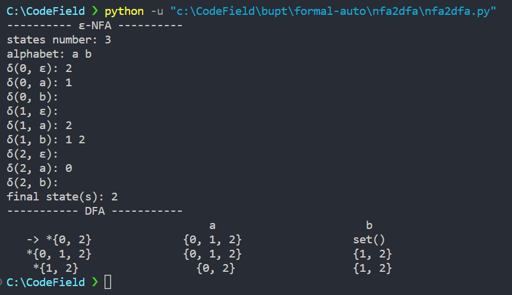
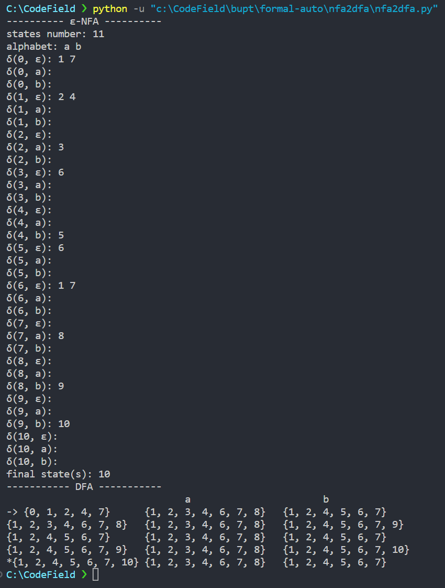

## 实验一：NFA 到 DFA 的转化

### 实验环境

使用 Python3 作为编程语言，在命令行进行输入输出

### 核心算法

使用子集构造法<sup>[1]</sup> ，由 ε-NFA 构造等价的 DFA

输入：一个 NFA $M$

输出：一个与 NFA $M$ 等价（即接受相同语言）的 DFA $D$

方法：构造 DFA $D$ 的状态转移矩阵 DTT

因为 DFA $D$ 的每个状态对应 NFA $M$ 的一个状态子集，所以构造状态转移矩阵 DTT 时，对给定的输入符号串，使 $D$ “并行地” 模拟 $M$ 所能产生的所有可能的转换。令 $q$ 为 NFA $M$ 的状态， $T$ 为 NFA $M$ 的一个状态子集，引入以下操作

- $\varepsilon\_closure(q)=\{q'\,|\,从q出发，经过 \varepsilon 道路可以到达状态q'\}$
- $\varepsilon\_closure(T)=\bigcup\limits_{i=1}^{n}\varepsilon\_closure(q_i)$，其中 $q_i\in T$，从 $T$ 中任一状态出发，经过 $\varepsilon$ 道路后可以达到的状态集合
- $move(T,a)=\{q\,|\,\delta(q_i,a)=q,其中q_i\in T\}$，即从 $T$ 中状态 $q_i\in T$ 出发，经过输入符号 $a$ 之后可到达的状态集合

算法描述如下：

```
初态 e_closure(q0) 是 DQ 中唯一的状态，且未标记;
while (DQ 中存在一个未标记的状态 T) {
	标记 T;
	for (字母表中的每一个字母 a) {
		U = e_closure(move(T, a));
		if (U 不在 DQ 中) {
		 把 U 作为一个未标记的状态加入 DQ;
		}
		DTT[T, a] = U;
	}
}
```

关于 $\varepsilon\_closure(T)$ 的计算，是在有向图中从给定的结点集合出发，搜索可以到达的结点的问题。使用栈存放那些还未完成 $\varepsilon$ 转换检查的状态，其过程如下：

```
把 T 中所有状态的压入栈;
e_closure(T) 的初始值置为 T;
while (栈不空) {
	弹出栈顶元素 t;
	for (每一个状态 q 属于 e_closure(t)) {
		if (q 不属于 e_closure(T)) {
			把 q 加入 e_closure(T);
			把 q 压入栈;
		}
	}
}
```

### 代码实现

```python
global n # n 表示状态总数
global m # m 表示字母表中的字母个数
global alph # 字母表
alph = []
global nfa # NFA状态转移矩阵
nfa = []
global F # 终止状态集合
F = set()
global DTT # DFA状态转移矩阵
DTT = []

# 主函数
def main():
    get_nfa()
    nfa_to_dfa()
    print_dfa()

# 输入状态
def get_nfa():
    global n
    global m
    global alph
    global nfa
    global F
    print("---------- ε-NFA ----------")
    n = int(input("states number: "))
    print("alphabet: ", end="")
    alph = input().split()
    m = len(alph)
    alph.insert(0, "ε")
    for i in range(n):
        nfa.append([set()] * (m + 1))
        for j in range(m + 1):
            print("δ({}, {}): ".format(i, alph[j]), end="")
            nfa[i][j] = set(map(int, input().split()))
    print("final state(s): ", end="")
    F = set(map(int, input().split()))
    print("----------- DFA -----------")

# 求状态集的星闭包
def e_closure(T):
    global nfa
    if len(T) == 0:
        return set()
    if len(T) == 1:
        res = T
        q = T.pop()
        T.add(q)
        res = res.union(nfa[q][0])
        res = res.union(e_closure(nfa[q][0]))
        return res
    stk = []
    for i in T:
        stk.append(i)
    res = T.copy()
    while len(stk) > 0:
        t = stk.pop()
        for p in e_closure({t}):
            if not p in res:
                res.add(p)
                stk.append(p)
    return res

# 求指定转移函数后的状态集
def move(T, a):
    global nfa
    res = set()
    for q in T:
        res = res.union(nfa[q][a])
    return res

# 求DFA的状态转移矩阵
def nfa_to_dfa():
    global m
    global nfa
    global DTT
    DQ = []
    DQ_state = []
    DQ.append(e_closure({0}))
    DQ_state.append(False)
    while DQ_state.count(False) > 0:
        index = DQ_state.index(False)
        T = DQ[index]
        DQ_state[index] = True
        dtt = [T] + [set()] * m
        for a in range(1, m + 1):
            U = e_closure(move(T, a))
            if DQ.count(U) == 0 and len(U) > 0:
                DQ.append(U)
                DQ_state.append(False)
            dtt[a] = U
        DTT.append(dtt)

# 打印转换后DFA的状态转移矩阵
def print_dfa():
    global m
    global alph
    global DTT
    print("{:^16}\t".format(""), end="")
    for i in range(1, m + 1):
        print("{:^16}\t".format(alph[i]), end="")
    print()
    for i in range(len(DTT)):
        start = ""
        if i == 0:
            start += "-> "
        if is_final(DTT[i][0]):
            start += "*"
        start += str(DTT[i][0])
        print("{:^16}\t".format(start), end="")
        for j in range(1, m + 1):
            print("{:^16}\t".format(str(DTT[i][j])), end="")
        print()

# 判断DFA的某个子集状态是否为终止状态
def is_final(S):
    global F
    for i in F:
        if i in S:
            return True
    return False

# 程序入口
main()

```

### 程序演示

demo1



demo2



### 参考文献

<sup>[1]</sup> 李文生.编译原理与技术(第二版)[M].北京: 清华大学出版社, 2016: 38
